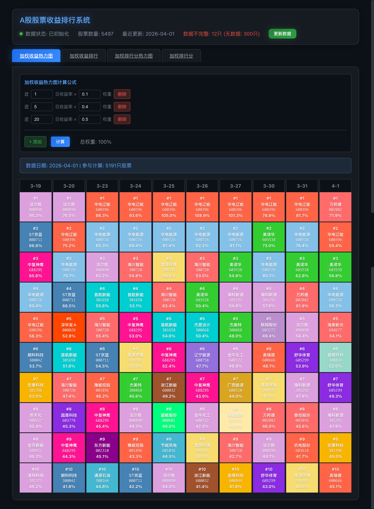

# A股股票收益排行系统

基于加权收益计算的A股股票分析与排行系统，提供热力图和排行榜两种可视化展示方式。

## 支持的股票市场

- 沪市主板（6开头）
- 科创板（688开头）
- 深市主板（00/002/003开头）
- 创业板（30开头）
- 北交所（83/87/88/92开头）

## 功能特性

- **加权收益计算**：支持自定义公式计算加权收益率
  - 公式格式：`近N日收益率 × 权重`
  - 例如：近1日×0.1 + 近5日×0.4 + 近20日×0.5
  - 权重总和无限制

- **加权收益热力图**：展示最近10个交易日收益前10的股票分布
- **加权收益排行**：展示当前收益排行，支持自定义计算公式
- **加权排行分计算**：基于各周期收益率排行计算的加权排行分
  - 公式格式：`近N日收益率排行 × 权重`
  - 排行分越小表示收益越好
  - 权重总和必须为1.0
- **加权排行分热力图**：展示最近10个交易日排行分前10的股票分布
- **数据更新**：支持全量更新和增量更新股票数据
  - 增量更新时自动补抓遗漏的数据
  - 有历史数据的股票：获取缺失日期的数据
  - 无历史数据的股票：获取最近60个交易日数据
  - 更新任务异步执行，支持进度查询和取消

## 页面预览



## 数据完整性展示

- 状态栏实时显示数据不完整/无数据的股票数量
- 各页面显示参与计算的股票数量
- 最近更新日期自动从数据库动态获取

## 技术栈

### 后端
- Python 3.9
- Flask
- SQLite
- akshare（A股数据获取）

### 前端
- React 18
- Vite 5
- react-router-dom

## 快速开始

### 环境要求
- Python 3.9+
- Node.js 18+

### 安装

**后端依赖：**
```bash
cd backend
python3 -m venv venv
source venv/bin/activate  # Linux/macOS
# venv\Scripts\activate   # Windows
pip install -r requirements.txt
```

**前端依赖：**
```bash
cd frontend
npm install
```

### 启动

**一键启动（推荐）：**
```bash
./start.sh
```
按 `Ctrl+C` 停止所有服务。

**分别启动：**

后端：
```bash
cd backend
source venv/bin/activate
python run.py
```

前端：
```bash
cd frontend
npm run dev
```

### 构建生产版本

```bash
cd frontend
npm run build
```

### 访问地址

- 前端：http://localhost:3001/
- 后端 API：http://localhost:5001/

## 配置

端口配置在 `config.json` 中统一管理：

```json
{
  "frontend": { "port": 3001 },
  "backend": { "port": 5001 }
}
```

生产/部署环境变量：
- `VITE_BACKEND_HOST` — 后端主机名（默认：`localhost`），在 `vite.config.js` 的 define 中设置
- `FLASK_DEBUG` — Flask 调试模式（默认：`1`），生产环境设为 `0`

## 项目结构

```
├── backend/
│   ├── app/
│   │   ├── calculator.py    # 加权收益计算逻辑和加权排行分逻辑
│   │   ├── data_fetcher.py  # 股票数据获取（双接口+限流保护）
│   │   ├── database.py      # 数据库操作（raw sqlite3）
│   │   ├── main.py          # Flask 应用工厂
│   │   └── routes.py        # API 路由（含输入验证）
│   ├── requirements.txt
│   └── run.py               # 入口文件
├── frontend/
│   ├── src/
│   │   ├── components/      # UI 组件
│   │   ├── context/         # 状态管理（React Context）
│   │   ├── pages/           # 页面组件（懒加载）
│   │   ├── utils/           # 工具函数
│   │   ├── api.js           # API 调用
│   │   ├── App.jsx          # 布局组件
│   │   └── main.jsx         # 入口文件（路由配置）
│   └── package.json
├── data/                    # 数据目录（SQLite数据库）
├── config.json              # 端口配置（前后端共用）
├── start.sh                 # 启动脚本
└── CLAUDE.md                # 项目说明
```

## API 接口

| 接口 | 方法 | 说明 |
|------|------|------|
| `/api/init-status` | GET | 获取系统初始化状态（含数据完整性信息） |
| `/api/data-completeness` | GET | 获取数据完整性状态 |
| `/api/weighted-return/calculate` | POST | 计算加权收益排行 |
| `/api/weighted-return/heatmap` | POST | 获取加权收益热力图数据 |
| `/api/weighted-rank/calculate` | POST | 计算加权排行分（权重总和须为1.0） |
| `/api/weighted-rank/heatmap` | POST | 获取加权排行分热力图数据 |
| `/api/update-data` | POST | 触发数据更新（异步） |
| `/api/update-status` | GET | 获取更新任务状态 |
| `/api/cancel-update` | POST | 取消更新任务 |
| `/api/latest-date` | GET | 获取最新交易日期 |

## 数据来源

股票数据通过 [akshare](https://github.com/akfamily/akshare) 获取：
- 支持东财（`stock_zh_a_hist`）、腾讯（`stock_zh_a_hist_tx`）两个数据接口自动切换
- 北交所股票只使用东财接口（腾讯接口不支持北交所）
- 内置限流保护：接口连续失败3次自动禁用60秒，请求间隔指数退避（0.5-1.5s基础延迟 × 1.0-4.0倍数）
- 交易日历缓存1小时，股票列表带内存缓存

## 备注

- 数据使用不复权价格计算（adjust=""）
- 北交所股票代码识别：83/87/88/92开头
- 股票详情链接指向雪球网 (xueqiu.com)
